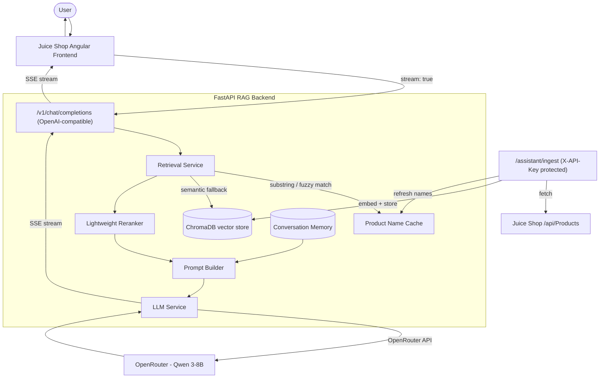

# Architecture

## System overview

## Request flow: a chat message

1. User types a message in the Juice Shop chatbot side panel.
2. Angular frontend sends `POST /v1/chat/completions` with `stream: true` — identical to how it would talk to a real OpenAI-compatible endpoint.
3. The retrieval service checks whether the query names a known product (exact/fuzzy match against a cached product-name list). If so, it fetches that product directly from Chroma via metadata filter. Otherwise, it embeds the query and performs semantic nearest-neighbor search, then reranks candidates using vector distance + keyword overlap.
4. If a `conversation_id` is present, recent turns and the last product discussed are pulled from in-memory conversation state and included in the prompt.
5. The prompt builder assembles a system prompt (grounding rules, hallucination prevention) + retrieved product context (labeled, not "Document N") + conversation history + the user's question.
6. The LLM service calls OpenRouter (Qwen 3-8B) with `stream=True`, and re-streams each token back to the frontend as Server-Sent Events, checking for client disconnects along the way.
7. Once complete, the turn is recorded into conversation memory for future follow-up questions.

## Request flow: product ingestion

1. `POST /assistant/ingest` (requires `X-API-Key`) fetches the full product catalog from Juice Shop's own `/api/Products` endpoint.
2. Each product is converted into a structured document and embedded via a locally-run `sentence-transformers` model (baked into the Docker image — no runtime download).
3. Embeddings + metadata are stored in ChromaDB.
4. The in-memory product-name cache (used for fast exact/fuzzy matching during retrieval) is refreshed.

## Why these design choices

| Decision | Reasoning |
|---|---|
| Custom retrieval before semantic search | Pure vector search on a small product catalog frequently retrieves the wrong but embedding-similar product — see RAG_ASSISTANT.md for the "apple juice" vs "Apple Pomace" example |
| OpenAI-compatible API surface | Zero changes needed to Juice Shop's existing chatbot frontend/config beyond pointing at a new URL |
| In-memory conversation store (not Redis/DB) | Proportionate to a single-instance deployment; documented upgrade path if scaled horizontally |
| Embedding model baked into Docker image | Avoids a multi-minute runtime download on every container start — this was the original bug this project fixed |
| Lightweight rerank (no cross-encoder) | Avoids a second heavy ML dependency; documented upgrade path if retrieval quality demands it |

See [RAG_ASSISTANT.md](./RAG_ASSISTANT.md) for implementation-level detail and [CONTRIBUTIONS.md](./CONTRIBUTIONS.md) for the full list of engineering work.
